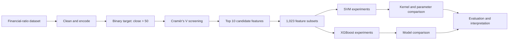

<div align="center">

# Stock Minimum Price Classification

**A research-oriented comparison of SVM and XGBoost using statistical feature screening and exhaustive feature-subset evaluation.**


</div>

## The research question

Can lagged financial ratios classify whether a stock's closing price is above a fixed minimum-price threshold?

The experiment treats this as a binary classification problem, screens candidate indicators with Cramér's V, evaluates every non-empty subset of the ten highest-ranked features, and compares Support Vector Machine and XGBoost models.

## Evidence at a glance

| Experimental signal | Recorded result |
|---|---:|
| Candidate features after screening | 10 |
| Feature subsets evaluated per model | 1,023 |
| Best subset size | 5 features |
| Best SVM test accuracy | 70.7% |
| Recorded XGBoost test accuracy | 69.5% |
| Research recognition | Best Paper · ICoDSA 2025 |

The best recorded SVM subset contains `DERn-1`, `QRn-2`, `QRn-1`, `PTBVn-1`, and `PBVn-1`.

## Experimental pipeline



## Why exhaustive subsets?

Selecting the top ten features individually does not guarantee that they work well together. Enumerating all `2¹⁰ − 1` non-empty combinations tests compact and larger subsets under the same experimental setup.

This makes the feature-selection decision inspectable:

- Which ratios repeatedly appear in high-performing subsets?
- Does adding more variables improve generalization?
- Do nonlinear SVM and tree-based models prefer different combinations?
- Is a smaller model competitive with a larger one?

## Model comparison

| Model | Test accuracy | Main observation |
|---|---:|---|
| Tuned SVM with RBF kernel | 70.7% | Best recorded holdout result |
| XGBoost | 69.5% | Competitive, but showed stronger overfitting in the recorded run |

The selected features connect three interpretable financial themes:

- **Leverage:** Debt-to-Equity Ratio.
- **Liquidity:** lagged Quick Ratios.
- **Valuation:** Price-to-Book-related indicators.

## Reproduce the notebook

Requires Python 3.8 or newer.

```bash
git clone https://github.com/akbaralqahri/Stocks_Classification.git
cd Stocks_Classification

python -m venv .venv
```

Activate and install:

```bash
# Windows
.venv\Scripts\activate

# macOS / Linux
source .venv/bin/activate

pip install -r requirements.txt jupyterlab
jupyter lab TA5.ipynb
```

## Repository map

```text
TA5.ipynb              complete experiment and recorded outputs
cramers_v_results.csv  exported statistical feature ranking
requirements.txt       reproducible Python dependencies
main.py                reserved application entry point
```

## Methodological limitations

- The target is a fixed nominal-price threshold, not return, direction, or risk-adjusted performance.
- Exhaustive subset selection against a holdout score can produce an optimistic model-selection estimate.
- The current experiment uses a stratified split rather than a walk-forward market evaluation.
- External market regimes, macroeconomic variables, transaction costs, and liquidity are not modeled.
- The results are a research benchmark and should not be interpreted as a trading signal.

Recommended next steps are nested cross-validation, a time-ordered holdout, probability calibration, regime testing, and a target tied to future return rather than absolute nominal price.

---

Built by [Muhammad Ali Akbar Al-Qahri](https://github.com/akbaralqahri) as a transparent machine-learning research case study.
